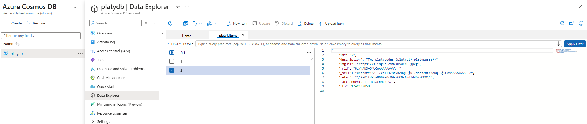

# Platypus of the day

I dette prosjektet koplar eg Azure Static Webapp med Azure Comsos DB (Nosql). Eg har laga ei enkel nettside som viser eit tilfeldig platypus-bilde frå ein database. Kvar gong eg pushar endringar til Github-repoet, vil sida verte deploya på nytt.

Eg har brukt denne [tutorialen](https://learn.microsoft.com/nb-no/azure/static-web-apps/database-azure-cosmos-db?tabs=powershell) når 
eg laga dette prosjektet.

Det kan vere greit å sjå på schemaet mitt, som ligg i fila "swa-db-connections/staticwebapp.database.schema.gql" Du kan samanlikne dette med databasen min som du ser bilete av her:




Merk at i det du legg til ein database, må du òg ha ei package.json fil med eit minimalt bygg-script. Mitt ser slik ut:

    ```json
    {
        "scripts": {
            "build": "echo 'No build needed'"
        }
    }
  
    ```

Prosjektet [køyrer her](https://calm-tree-028872b10.6.azurestaticapps.net)


